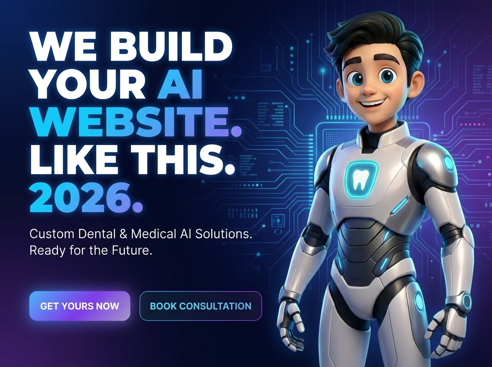
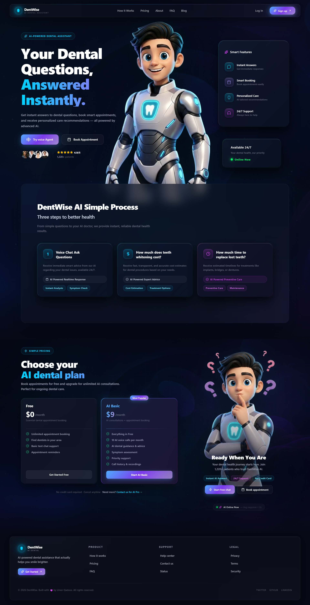
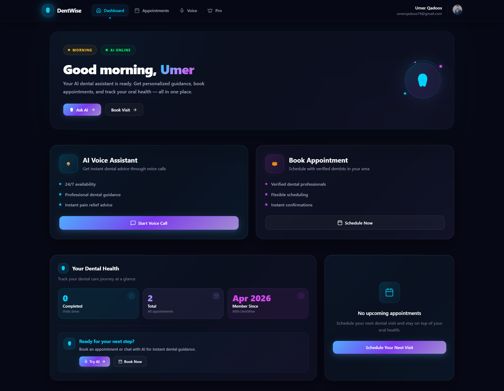
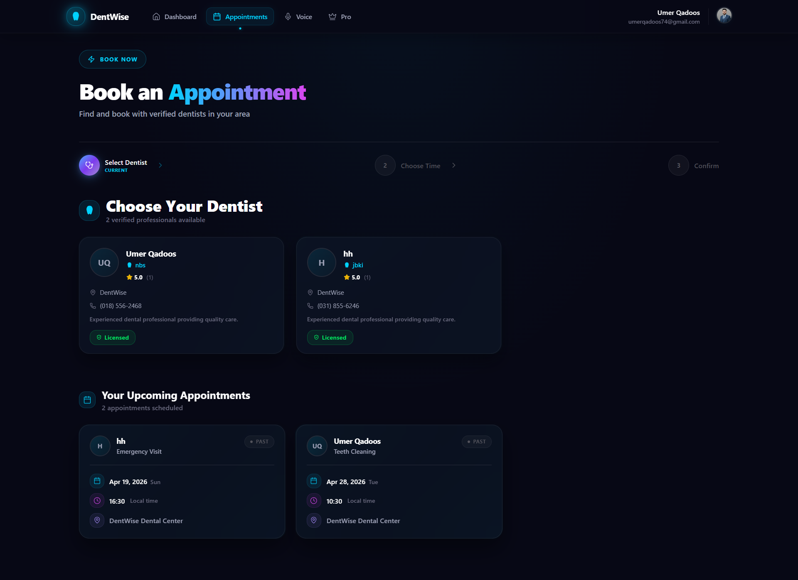
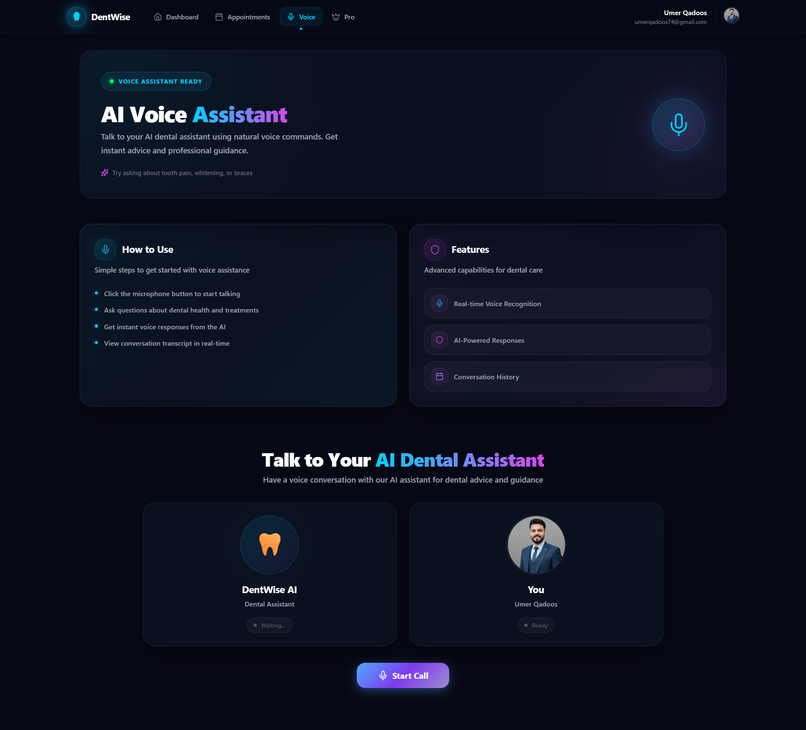
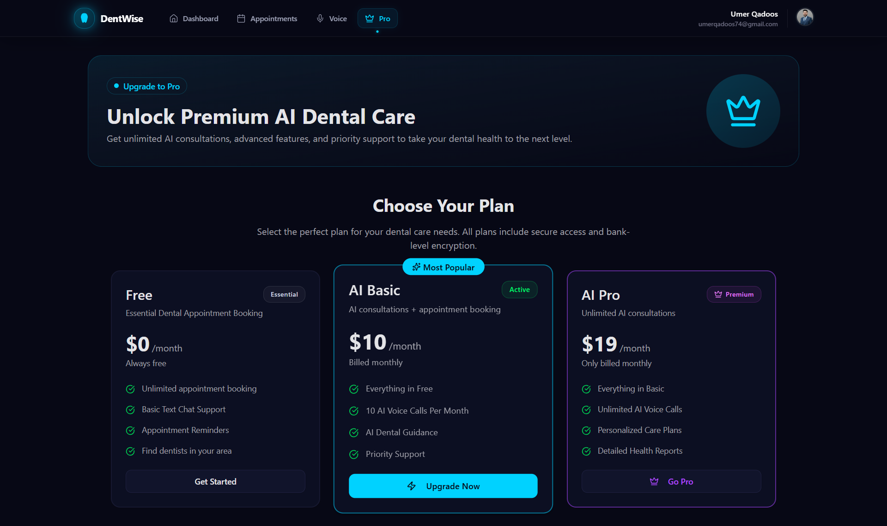

# dentist-Calling-website-Agent-Ai



## 🚀 Live Demo
**Website:** [https://dential-ai-calling-agent-website.vercel.app/](https://dential-ai-calling-agent-website.vercel.app/)

## 📋 Project Overview
Dential AI is a cutting-edge SaaS platform that automates dental clinic operations using AI voice agents. The system handles appointment scheduling, patient reminders, follow-ups, and dental health consultations through natural voice conversations.

### ✨ Key Features
- **AI Voice Calling Agent** - Human-like voice conversations for appointment booking
- **Smart Appointment Management** - Automated scheduling, reminders, and follow-ups
- **Patient Dashboard** - Personalized dental health tracking and history
- **Admin Portal** - Clinic management, doctor roster, and analytics
- **Pro Subscription** - Advanced AI features for clinics
- **Secure Payments** - Stripe integration for subscription management
- **Email Notifications** - Automated appointment confirmations

## 🖼️ Screenshots

### Main Landing Page


### Dashboard


### Appointment Booking


### AI Voice Calling Interface


### Pro Subscription Plans


## 🛠️ Technical Stack
- **Frontend:** Next.js 14, TypeScript, Tailwind CSS, Shadcn/UI
- **Backend:** Node.js, Express.js, Prisma ORM
- **Database:** PostgreSQL with Prisma
- **AI/ML:** Vapi.ai for voice AI, OpenAI integration
- **Payments:** Stripe for subscription handling
- **Email:** Resend for transactional emails
- **Deployment:** Vercel, AWS
- **Authentication:** JWT, bcrypt, secure sessions

## 🎯 Business Value
- **30% Reduction** in administrative workload for dental clinics
- **40% Faster** appointment scheduling process
- **24/7 Availability** of AI voice agents
- **Personalized** patient engagement
- **Scalable** architecture for multi-clinic deployment

## 👨‍💻 Developer Profile

### Umer Qadoos
**Full Stack Developer · Islamabad, Pakistan**

📞 **+92 318 556 2461**  
📧 **umerqadoos74@gmail.com**  
🌐 **Portfolio:** [https://umerqadoos.codes/](https://umerqadoos.codes/)  
💼 **LinkedIn:** [Umer Qadoos](https://linkedin.com/in/umerqadoos)  
🐙 **GitHub:** [@umerqadoos](https://github.com/umerqadoos)

### 🏆 Professional Summary
Full Stack Developer with 1+ year of professional experience delivering scalable, production-grade web applications using React.js, Next.js, Node.js, Express.js, MongoDB, PostgreSQL, GraphQL, and TypeScript. Shipped 7+ end-to-end products across AI, e-commerce, property survey, and policy automation domains — reducing development turnaround by 30% through component-driven architecture and API-first design.

### 🎓 Education
**University of Haripur**  
*Bachelor of Science in Software Engineering*  
• Relevant Coursework: Data Structures & Algorithms, Database Management, Web Engineering, Systems Analysis

### 💼 Experience
**Full Stack Developer | RYZELS Pvt. Ltd.**  
*Aug 2024 – Oct 2025 | Islamabad, Pakistan*

- Delivered 7 full-stack production applications with zero critical post-deployment bugs and 30% faster feature delivery by architecting reusable React.js/Next.js component libraries
- Boosted page load performance by 40% (Lighthouse score 90+) by implementing Next.js SSR, SSG, lazy loading, and code-splitting strategies
- Integrated Langchain, OpenAI API, and Replicate AI into 3 client products, cutting manual workload by 50% through custom Node.js/Express.js LLM orchestration middleware
- Secured all platforms with JWT, bcrypt, cookie-parser, and RBAC middleware — achieving zero authentication-related security incidents

## 📈 Technical Skills
- **Languages:** JavaScript (ES6+), TypeScript, Python, SQL, HTML5, CSS3
- **Frontend:** React.js, Next.js, Vite, Tailwind CSS, Material UI, Shadcn/UI, Responsive Design
- **Backend:** Node.js, Express.js, REST API, GraphQL, tRPC, JWT, bcrypt, Multer, Cookie-Parser
- **Databases:** MongoDB (Mongoose), PostgreSQL, Prisma ORM, Supabase (pgvector), Pinecone
- **AI & Cloud:** Langchain, OpenAI API, Replicate AI, RAG, AWS, Vercel, Docker, Git, CI/CD, Stripe

## 🔒 Source Code Access
**This project's source code is proprietary and protected.**  
The complete codebase, including all frontend components, backend APIs, database schemas, and AI integration logic, is available for purchase or licensing.

### 💰 Interested in This Solution?
If you're looking to:
- Implement a similar AI voice calling system for your business
- Purchase the complete source code
- Hire me for custom development
- Get a customized version for your industry

## 📞 Contact for Purchasing & Licensing
**Umer Qadoos**  
📱 **Phone:** +92 318 556 2461  
📧 **Email:** umerqadoos74@gmail.com  
🌐 **Website:** [https://umerqadoos.codes/](https://umerqadoos.codes/)  
💼 **LinkedIn:** [linkedin.com/in/umerqadoos](https://linkedin.com/in/umerqadoos)

### 📋 What You'll Get:
1. **Complete Source Code** - All frontend and backend files
2. **Database Schema** - PostgreSQL/Prisma setup
3. **AI Integration** - Vapi.ai and OpenAI configuration
4. **Payment Integration** - Stripe subscription handling
5. **Deployment Guide** - Step-by-step deployment instructions
6. **Technical Support** - 30 days of support after purchase
7. **Customization Options** - Tailored to your specific needs

## 🚀 Quick Start (For Licensed Users Only)
```bash
# Clone the repository
git clone <private-repo-url>

# Install dependencies
npm install

# Set up environment variables
cp .env.example .env

# Run database migrations
npx prisma migrate dev

# Start development server
npm run dev
```

## 📄 License
This software is proprietary and confidential. Unauthorized copying, distribution, or use is strictly prohibited. All rights reserved © 2025 Umer Qadoos.

---
*Built with ❤️ using Next.js, TypeScript, and cutting-edge AI technologies*